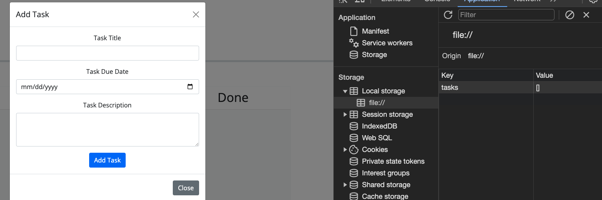
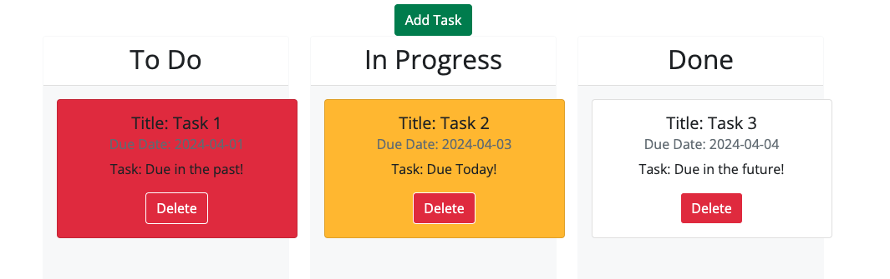

# task-board-hw-5
Create a simple task board application that allows a team to manage project tasks by modifying starter code and also change colors of the tasks depening on the due date.

## No installation needed just go to the deployed app at the following link to use!

https://soko77788.github.io/task-board-hw-5/

## Usage 

A quick glace at what the app looks like and how it operates. 

1. Click the Add Task button and fill out the information in the Modal. This information is very important and will be saved to LocalStorage to be used to save and create the cards. 

2. **Important** Use the date picker to find a date and depending on the date the color of the card will render different. **Past Due** is Red, **Due Today** is Yellow, and **Due in Future** is White. 

3. Here's what the created card will look like. These are fully draggable and droppable. Simply place the card in the lane corresponding to the status of the project. 

4. Clicking the Delete button will remove the task from the list and delete the saved data from Local Storage!

## Credits

Built with Bootstrap, Jquery, and dayjs libraries!

Heavily influenced code of the bootcamp instructor Josh who we coded along with for a different similar project. 

## What I learned and Obstacles overcome

1. I learned about the dayjs library and how you can manipulate time to output different code.

2. I learned about creating draggable and droppable elements and how to make certain sections of the page accept or "snap" draggable items
Major obstacles for this was determining exactly what is an acceptable drop lane. Luckily the starter code gave a good indicator of how to format this. 

3. I learned about page initialization and making sure the page loads updated information upon refresh. 

4. I learned about the stack and z-index properties to make items drop --on top-- of other elements. That was an obstacle for alot of people. 

5. A big obstacle is learning how to change the card color to white only when it's dropped in the done lane. 

6. Another learning experience/Obstacle was getting the delete button to work so it just deletes one task card and erases that data from localStorage. At the start clicking delete would delete all the cards. 

## No contributions, No Contact Please, No future Updates. 
